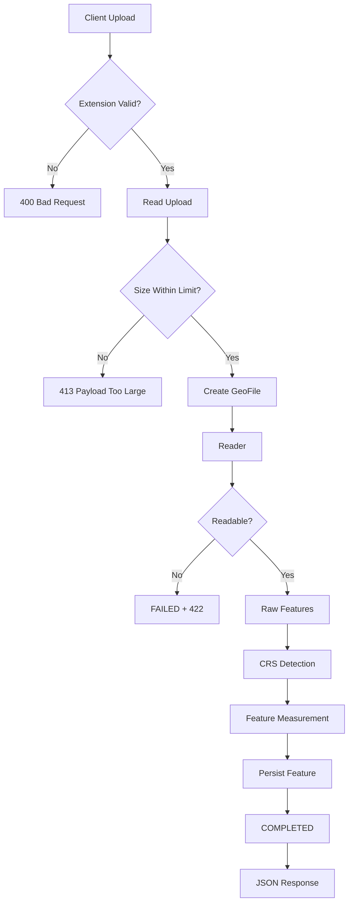

# 🌍 Geo Measurement API

<p align="center">
  <strong>Production-style geospatial file processing & measurement API</strong>
</p>

<p align="center">
  Upload geospatial data → Parse features → Detect CRS → Reproject safely → Calculate measurements → Query results
</p>

<p align="center">


</p>

---

## ✨ What is Geo Measurement API?

**Geo Measurement API** is a FastAPI service designed to process common geospatial survey files and return structured feature information together with accurate metric measurements.

It accepts:

* 🗺️ **Shapefile ZIP archives**
* 📍 **KML**
* 🌐 **KMZ**

For every supported feature, the API can extract:

| Capability                   | Supported |
| ---------------------------- | :-------: |
| Feature ID                   |     ✅     |
| Geometry type                |     ✅     |
| GeoJSON geometry             |     ✅     |
| CRS information              |     ✅     |
| Attributes / properties      |     ✅     |
| Polygon area                 |     ✅     |
| Polygon perimeter            |     ✅     |
| Line length                  |     ✅     |
| CRS-aware measurement        |     ✅     |
| Feature-level error handling |     ✅     |
| Pagination                   |     ✅     |
| Filtering                    |     ✅     |
| Upload size limits           |     ✅     |
| ZIP-bomb protection          |     ✅     |
| XML security hardening       |     ✅     |

### 🎯 Core principle

> **Never measure latitude/longitude degrees as if they were metres.**

Geometries are transformed into an appropriate metric coordinate reference system before measurement whenever required.

---

# 🚀 Why This Project?

Geospatial measurement looks deceptively simple.

A polygon has coordinates.

A line has coordinates.

So why not just call:

```python
geometry.area
geometry.length
```

The problem is **CRS**.

A geometry stored in:

```text
EPSG:4326
```

uses angular coordinates:

```text
longitude / latitude
```

not metres.

Measuring those coordinates directly can produce meaningless results.

This project therefore treats **coordinate reference systems as a first-class part of measurement**.

```text
                    ┌───────────────────────┐
                    │   Uploaded Geometry   │
                    └───────────┬───────────┘
                                │
                                ▼
                    ┌───────────────────────┐
                    │     Detect Source CRS │
                    └───────────┬───────────┘
                                │
                    ┌───────────▼───────────┐
                    │ Is CRS suitable for   │
                    │ direct measurement?   │
                    └───────────┬───────────┘
                                │
                   ┌────────────┴────────────┐
                   │                         │
                  YES                       NO
                   │                         │
                   ▼                         ▼
          ┌────────────────┐       ┌─────────────────┐
          │ Measure using  │       │ Select metric   │
          │ native CRS     │       │ projection      │
          └───────┬────────┘       └────────┬────────┘
                  │                         │
                  │                         ▼
                  │                ┌─────────────────┐
                  │                │ Reproject       │
                  │                │ geometry        │
                  │                └────────┬────────┘
                  │                         │
                  └────────────┬────────────┘
                               ▼
                    ┌───────────────────────┐
                    │ Calculate measurement │
                    └───────────┬───────────┘
                                ▼
                    ┌───────────────────────┐
                    │ Persist + Return JSON │
                    └───────────────────────┘
```

---

# 🧩 Features

## 📂 Multi-format ingestion

### Shapefile

Supports `.zip` archives containing:

```text
.shp
.shx
.dbf
.prj
.cpg
```

Required components are validated before processing.

Optional CRS and encoding information are handled intelligently.

---

### 📍 KML

The KML reader supports:

* `Placemark`
* `Point`
* `LineString`
* `Polygon`
* `MultiGeometry`
* Polygon holes
* Nested `Folder`
* `Document`
* `ExtendedData`
* KML namespaces
* `name`
* `description`
* KML IDs

---

### 🌐 KMZ

KMZ files are treated as ZIP containers.

The implementation searches for:

```text
doc.kml
```

or an appropriate `.kml` document inside the archive.

---

# 📐 Measurement Engine

The measurement engine is deliberately separated from file parsing.

That means:

```text
KML ─────────────┐
                 │
Shapefile ───────┼──► RawFeature ──► Measurement Engine
                 │
Future formats ──┘
```

The calculator doesn't care whether the geometry came from KML or a Shapefile.

It only receives:

```text
geometry + CRS
```

and returns a measurement result.

---

## 📊 Supported Measurements

| Geometry             | Result           |
| -------------------- | ---------------- |
| `Polygon`            | Area + perimeter |
| `MultiPolygon`       | Area + perimeter |
| `LineString`         | Length           |
| `MultiLineString`    | Length           |
| `LinearRing`         | Length           |
| `Point`              | Not applicable   |
| `MultiPoint`         | Not applicable   |
| `GeometryCollection` | Unsupported      |
| KML `Track`          | Unsupported      |
| KML `Model`          | Unsupported      |

---

# 🧭 CRS Intelligence

This is one of the most important parts of the project.

## Geographic CRS

For geographic coordinate systems such as:

```text
EPSG:4326
```

the API selects the **UTM zone containing the feature centroid**.

```text
WGS84 longitude / latitude
            │
            ▼
     Feature centroid
            │
            ▼
       UTM zone
            │
            ▼
      Metric geometry
            │
            ▼
       Measurement
```

This avoids treating degrees as distances.

---

## Projected CRS

If the source data is already in a suitable projected CRS, measurements are performed natively.

For example:

```text
EPSG:32644
UTM Zone 44N
```

can be measured directly in metres.

Projected CRSs using units such as US survey feet are converted to metres where required.

---

## ⚠️ Web Mercator

A projected CRS is **not automatically a good measurement CRS**.

For example:

```text
EPSG:3857
Web Mercator
```

uses metres but significantly distorts scale and area at higher latitudes.

The API therefore handles Mercator-family projections specially:

```text
Web Mercator
     │
     ▼
 WGS84
     │
     ▼
 Local UTM
     │
     ▼
 Accurate measurement
```

---

# 🎯 Accuracy

The test suite validates projected measurements against geodesic calculations using `pyproj.Geod`.

Test regions include:

* 🇮🇳 India
* 🇬🇧 London
* 🇦🇺 Sydney
* 🇫🇮 Helsinki

Results remain within approximately:

```text
< 0.2%
```

and are typically within:

```text
< 0.08%
```

for the tested parcel/route-scale geometries.

A dedicated Web Mercator test also demonstrates why measuring directly in EPSG:3857 can produce dramatically incorrect area results.

---

# 🏗️ Architecture

```text
app/
│
├── main.py
│   └── Application factory
│
├── config.py
│   └── Environment-based settings
│
├── database.py
│   └── SQLAlchemy engine
│
├── models.py
│   └── GeoFile + Feature models
│
├── schemas.py
│   └── Pydantic API contracts
│
├── api.py
│   └── HTTP layer
│
├── processing.py
│   └── Upload → Parse → Measure → Persist
│
├── errors.py
│   └── InvalidFileError
│
├── readers/
│   │
│   ├── __init__.py
│   │   ├── Reader selection
│   │
│   ├── base.py
│   │   └── Format-independent models
│   │
│   ├── shapefile_reader.py
│   │   └── Shapefile parsing
│   │
│   ├── kml_reader.py
│   │   └── KML / KMZ parsing
│   │
│   └── zip_utils.py
│       └── Safe ZIP handling
│
├── measurement/
│   │
│   ├── crs.py
│   │   └── CRS detection + projection
│   │
│   └── calculator.py
│       └── Area + length calculations
│
tests/
│
├── test_measurement.py
├── test_readers.py
└── test_api.py
│
└── scripts/
    └── make_samples.py
```

---

# 🔄 Processing Pipeline



---

# 🛡️ Security

Uploaded files are treated as **untrusted input**.

The project includes multiple defensive layers.

### 📦 Upload size protection

Configurable:

```text
MAX_UPLOAD_MB=50
```

The service reads at most:

```text
MAX_UPLOAD_MB + 1
```

bytes to detect oversized uploads.

---

### 💣 ZIP-bomb protection

ZIP archives are never blindly extracted to disk.

The implementation:

* Reads ZIP contents safely
* Checks total uncompressed size
* Rejects excessive archives
* Avoids ZIP path traversal

Default:

```text
MAX_UNCOMPRESSED_MB=200
```

---

### 🧨 XML security

KML processing uses:

```text
defusedxml
```

to protect against attacks including:

* XXE
* Entity expansion
* Billion-laughs-style attacks

---

### 🔢 Feature limits

Large files can be restricted using:

```text
MAX_FEATURES=100000
```

---

# 🧠 Important Design Decisions

<details>
<summary><strong>Why FastAPI?</strong></summary>

The application is API-first and doesn't require templates, admin panels or traditional server-rendered pages.

FastAPI provides:

* Typed request/response models
* Automatic OpenAPI documentation
* Swagger UI
* Async-ready architecture
* Low boilerplate
* Easy testing

</details>

<details>
<summary><strong>Why pyshp + Shapely + pyproj instead of GDAL?</strong></summary>

GDAL is extremely capable, but introduces native dependencies that can complicate installation, particularly on Windows and minimal containers.

This project only needs a focused set of formats, so pure-Python-friendly components provide a much simpler deployment story.

The reader interface also makes future migration straightforward.

</details>

<details>
<summary><strong>Why a custom KML reader?</strong></summary>

The KML parser provides precise control over:

* Supported geometry types
* Namespaces
* Nested folders
* ExtendedData
* Security
* Partial feature failures

`defusedxml` also provides hardened XML parsing.

</details>

<details>
<summary><strong>Why UTM?</strong></summary>

UTM is:

* Widely understood
* Metric
* Easy to reproduce in GIS software
* Appropriate for local/regional survey-scale features
* Available through standard EPSG identifiers

Each geographic feature gets the UTM zone corresponding to its centroid.

</details>

<details>
<summary><strong>Why store measurements?</strong></summary>

Measurements are calculated once during upload.

Therefore:

```text
UPLOAD
   ↓
PARSE
   ↓
MEASURE
   ↓
STORE
   ↓
GET
```

A measurement request becomes primarily a database read rather than another geospatial computation.

</details>

<details>
<summary><strong>Why partial feature failures?</strong></summary>

One bad feature shouldn't destroy an otherwise valid dataset.

For example:

```text
Feature 1 → measured
Feature 2 → measured
Feature 3 → malformed
Feature 4 → measured
Feature 5 → unsupported
```

The file can still complete successfully while preserving the problems at feature level.

</details>

---

# 🗄️ Data Model

The application uses SQLite by default.

```text
┌─────────────────────────┐
│        GeoFile          │
├─────────────────────────┤
│ id                      │
│ filename                │
│ file_type               │
│ size_bytes              │
│ status                  │
│ feature_count           │
│ crs                     │
│ crs_name                │
│ crs_assumed             │
│ warnings                │
│ error                   │
│ created_at              │
│ processed_at             │
└────────────┬────────────┘
             │
             │ 1 : N
             ▼
┌─────────────────────────┐
│        Feature          │
├─────────────────────────┤
│ id                      │
│ feature_id              │
│ source_id               │
│ geometry_type            │
│ geometry                │
│ crs                     │
│ properties              │
│ measurement status      │
│ measurement values      │
└─────────────────────────┘
```

SQLite can be replaced with another SQLAlchemy-supported database through:

```text
DATABASE_URL
```

---

# 🌐 API

## Endpoint Overview

|  Method  | Endpoint                        | Purpose               |
| :------: | ------------------------------- | --------------------- |
|  `POST`  | `/api/files/`                   | Upload + process file |
|   `GET`  | `/api/files/`                   | List uploaded files   |
|   `GET`  | `/api/files/{id}/`              | File information      |
|   `GET`  | `/api/files/{id}/features/`     | Feature data          |
|   `GET`  | `/api/files/{id}/measurements/` | Measurements          |
| `DELETE` | `/api/files/{id}/`              | Delete file           |
|   `GET`  | `/health`                       | Health check          |

---

# 📤 Upload

```bash
curl -F "file=@sample_data/survey.kml" \
  http://127.0.0.1:8000/api/files/
```

Example response:

```json
{
  "id": "717fa8bb-0284-4ba1-bb79-fb9c007f7a4b",
  "filename": "survey.kml",
  "file_type": "kml",
  "size_bytes": 1541,
  "status": "COMPLETED",
  "feature_count": 5,
  "crs": "EPSG:4326",
  "crs_name": "WGS 84",
  "crs_assumed": false,
  "warnings": [],
  "error": null
}
```

---

# 🔎 Features

```bash
curl \
  "http://127.0.0.1:8000/api/files/<id>/features/?limit=2"
```

Returns:

* Feature ID
* Source ID
* Geometry type
* CRS
* GeoJSON geometry
* Properties
* Pagination metadata

Example:

```json
{
  "file_id": "717fa8bb-...",
  "items": [
    {
      "feature_id": 0,
      "source_id": "field-1",
      "geometry_type": "Polygon",
      "crs": "EPSG:4326",
      "geometry": {
        "type": "Polygon",
        "coordinates": []
      },
      "properties": {
        "name": "North field",
        "crop": "Paddy"
      }
    }
  ],
  "total": 5,
  "limit": 2,
  "offset": 0
}
```

---

# 📏 Measurements

```bash
curl \
  "http://127.0.0.1:8000/api/files/<id>/measurements/"
```

Filter:

```bash
curl \
  "http://127.0.0.1:8000/api/files/<id>/measurements/?status=measured"
```

Example:

```json
{
  "file_id": "717fa8bb-...",
  "source_crs": "EPSG:4326",
  "units": {
    "area": "m²",
    "length": "m",
    "perimeter": "m"
  },
  "summary": {
    "total_features": 5,
    "measured": 3,
    "not_applicable": 1,
    "unsupported": 1,
    "errors": 0,
    "total_area_m2": 365961.77,
    "total_length_m": 3215.8
  }
}
```

---

# 📊 Measurement Status

| Status             | Meaning                            |
| ------------------ | ---------------------------------- |
| 🟢 `measured`      | Geometry successfully measured     |
| ⚪ `not_applicable` | Point-like geometry                |
| 🟠 `unsupported`   | Geometry type isn't supported      |
| 🔴 `error`         | Measurement could not be performed |

---

# ⚙️ Configuration

Environment variables:

| Variable              |                   Default | Description               |
| --------------------- | ------------------------: | ------------------------- |
| `DATABASE_URL`        | `sqlite:///./geofiles.db` | SQLAlchemy database URL   |
| `MAX_UPLOAD_MB`       |                      `50` | Maximum upload size       |
| `MAX_UNCOMPRESSED_MB` |                     `200` | Maximum ZIP/KMZ expansion |
| `MAX_FEATURES`        |                  `100000` | Maximum features per file |

Example:

```bash
MAX_UPLOAD_MB=100
MAX_FEATURES=250000
```

---

# 🧪 Testing

The project currently contains:

# **98 tests**

Run:

```bash
pytest -q
```

Expected:

```text
98 passed
```

### Test coverage includes

#### Measurement

* UTM zone selection
* CRS handling
* Geographic CRS
* Projected CRS
* US survey feet
* Web Mercator
* Geodesic accuracy comparisons
* Holes
* MultiPolygon
* 3D geometry
* Points
* Empty geometry
* Unknown CRS
* Invalid polygons

#### Readers

* Shapefile attributes
* CRS detection
* `.cpg` encoding
* Missing `.prj`
* Missing `.shx`
* Missing `.dbf`
* NULL shapes
* Multiple shapefiles
* Corrupt archives
* ZIP bombs
* Feature limits
* KML folders
* KML holes
* MultiGeometry
* ExtendedData
* Namespaces
* Malformed coordinates
* XXE
* Entity expansion
* KMZ

#### API

* Upload
* File information
* Listing
* Pagination
* Filtering
* Measurements
* Summary
* Delete
* 400 errors
* 413 errors
* 422 errors
* Partial feature failures

---

# 🏃 Quick Start

## 1. Clone

```bash
git clone https://github.com/<your-username>/geo-measurement-api.git
cd geo-measurement-api
```

## 2. Create virtual environment

```bash
python -m venv .venv
```

### Windows

```powershell
.venv\Scripts\Activate.ps1
```

or:

```cmd
.venv\Scripts\activate.bat
```

### macOS / Linux

```bash
source .venv/bin/activate
```

---

## 3. Install dependencies

```bash
pip install -r requirements.txt
```

---

## 4. Run tests

```bash
pytest -q
```

Expected:

```text
98 passed
```

---

## 5. Start API

```bash
uvicorn app.main:create_app --factory --reload
```

Server:

```text
http://127.0.0.1:8000
```

Swagger:

```text
http://127.0.0.1:8000/docs
```

---

# 🧪 Sample Data

The repository contains ready-to-use datasets:

| File                | Description                                                     |
| ------------------- | --------------------------------------------------------------- |
| `survey.kml`        | Polygon, LineString, Point, MultiGeometry and unsupported Track |
| `parcels_wgs84.zip` | WGS84 polygons including a polygon with a hole                  |
| `plots_utm44n.zip`  | Projected UTM polygons with known 10,000 m² areas               |
| `roads_wgs84.zip`   | WGS84 LineStrings                                               |

Regenerate samples:

```bash
python scripts/make_samples.py
```

---

# 💡 Example Workflow

```text
             ┌──────────────┐
             │ Survey File  │
             └──────┬───────┘
                    │
                    ▼
             ┌──────────────┐
             │ POST /files/ │
             └──────┬───────┘
                    │
                    ▼
          ┌─────────────────────┐
          │ Parse + Validate    │
          └──────────┬──────────┘
                     │
                     ▼
          ┌─────────────────────┐
          │ Detect CRS          │
          └──────────┬──────────┘
                     │
                     ▼
          ┌─────────────────────┐
          │ Choose Projection   │
          └──────────┬──────────┘
                     │
                     ▼
          ┌─────────────────────┐
          │ Calculate Area /    │
          │ Length              │
          └──────────┬──────────┘
                     │
                     ▼
          ┌─────────────────────┐
          │ Store in SQLite     │
          └──────────┬──────────┘
                     │
             ┌───────┴────────┐
             ▼                ▼
       GET /features     GET /measurements
```

---

# 🧠 Key Learnings

### 01 — Projected does not automatically mean accurate

A CRS can use metres and still distort measurements.

**Web Mercator is the classic example.**

---

### 02 — Axis order matters

EPSG:4326 officially describes axes as:

```text
latitude, longitude
```

while most geospatial software/data workflows use:

```text
longitude, latitude
```

The project therefore uses:

```python
always_xy=True
```

with pyproj transformers.

---

### 03 — Shapefiles are not one file

A Shapefile dataset commonly consists of:

```text
.shp
.shx
.dbf
.prj
.cpg
```

Losing one of these files can affect geometry, attributes, CRS or encoding.

---

### 04 — Validate against an independent reference

A measurement that merely returns a plausible number isn't enough.

The test suite compares projected results with geodesic calculations to establish actual accuracy.

---

### 05 — Real geospatial data is messy

Real datasets contain:

* Invalid polygons
* NULL shapes
* Missing CRS
* Mixed geometries
* Altitude coordinates
* Encoding problems
* Junk files
* Unsupported geometry types

The API is designed to **report problems instead of silently destroying useful data**.

---

# 🔮 Future Scope

The architecture is deliberately designed for extension.

### 🗺️ More formats

Potential additions:

```text
GeoJSON
GeoPackage
GML
FlatGeobuf
```

using Fiona / pyogrio where appropriate.

---

### ⚡ Background processing

For very large datasets:

```text
POST
 │
 ▼
202 Accepted
 │
 ▼
Background Worker
 │
 ├── Parse
 ├── Measure
 └── Persist
 │
 ▼
GET /files/{id}
```

Potential stack:

```text
Celery / RQ + Redis
```

---

### 🐘 PostGIS

Future spatial functionality could include:

* Bounding-box searches
* Spatial filtering
* Distance queries
* `ST_Area`
* `ST_Length`
* Geography calculations
* Spatial indexing

---

### 📐 Advanced measurement

Potential options:

```text
?method=geodesic
?method=projected

?units=m
?units=ft
?units=acres
```

---

### 📦 Large datasets

Potential improvements:

* Streaming readers
* Chunked processing
* Background jobs
* Progress tracking
* Object storage
* Downloadable exports

---

### 🔐 Production authentication

Future production capabilities:

* User accounts
* File ownership
* Authentication
* Authorization
* Rate limiting
* API keys
* Audit logs

---

### 🚀 Deployment

Potential deployment additions:

```text
Docker
PostgreSQL
PostGIS
Alembic
CI/CD
Cloud object storage
Production monitoring
```

---

# 🧱 Technology Stack

```text
                    GEO MEASUREMENT API
                           │
          ┌────────────────┼────────────────┐
          │                │                │
       API Layer       Processing       Persistence
          │                │                │
       FastAPI          Shapely         SQLAlchemy
          │              pyproj             │
       Pydantic          pyshp            SQLite
          │            defusedxml
          │
       Swagger
       OpenAPI
```

### Core technologies

| Technology       | Purpose                         |
| ---------------- | ------------------------------- |
| 🐍 Python 3.11+  | Application runtime             |
| ⚡ FastAPI        | REST API                        |
| 📐 Shapely 2     | Geometry processing             |
| 🌍 pyproj        | CRS + coordinate transformation |
| 📦 pyshp         | Shapefile parsing               |
| 🛡️ defusedxml   | Secure XML parsing              |
| 🗄️ SQLAlchemy 2 | Persistence layer               |
| 💾 SQLite        | Default database                |
| 🧪 pytest        | Automated testing               |

---

# 📁 Project Philosophy

The architecture intentionally follows a clean separation of responsibilities:

```text
                    ┌─────────────────┐
                    │    API Layer    │
                    └────────┬────────┘
                             │
                    ┌────────▼────────┐
                    │   Processing    │
                    └────────┬────────┘
                             │
              ┌──────────────┴──────────────┐
              │                             │
      ┌───────▼────────┐           ┌────────▼────────┐
      │     Readers    │           │   Measurement   │
      └───────┬────────┘           └────────┬────────┘
              │                             │
              └──────────────┬──────────────┘
                             │
                    ┌────────▼────────┐
                    │    Database     │
                    └─────────────────┘
```

**Readers know about formats.**

**Measurement knows about geometry and CRS.**

**The API knows about HTTP.**

**The database layer knows about persistence.**

This makes the system easier to test, maintain and extend.

---

# ⭐ Project Highlights

```text
✓ 98 automated tests
✓ CRS-aware measurements
✓ Per-feature UTM projection
✓ Geodesic accuracy validation
✓ Web Mercator protection
✓ Shapefile / KML / KMZ support
✓ Feature-level fault tolerance
✓ ZIP-bomb protection
✓ XML security hardening
✓ Upload limits
✓ Pagination
✓ Filtering
✓ OpenAPI / Swagger documentation
✓ SQLite by default
✓ PostgreSQL-ready architecture
✓ Clean reader abstraction
✓ No GDAL/system libraries required
```

---

# 🤝 Contributing

Contributions, suggestions and improvements are welcome.

A typical workflow:

```bash
git clone <repository>
cd geo-measurement-api

python -m venv .venv
pip install -r requirements.txt

pytest -q
```

Before submitting a change, make sure the complete test suite passes.

---

# 📜 License

This project is available under the **MIT License**.

---

# 👨‍💻 Author

**Gouse Kareem**

<p align="center">

### 🌍 Built for reliable geospatial measurement

**Parse. Project. Measure. Persist.**

</p>

<p align="center">
  <sub>Geospatial data deserves measurement that respects its coordinate system.</sub>
</p>
